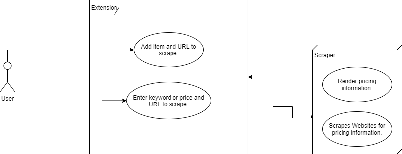

# Price Monitoring Scraper Extension

## Project Abstract
_The extension will provide a way for the user to record items and monitor their prices. This will allow the user to watch items on e-commerce websites like Amazon or eBay. The extension will have a list and the user can add items to it by providing a name and a URL that contains pricing information about the item. User can choose to be notified of the price change when the price falls under a certain percentage. Other additions could be automatically scraping a website for a specific item and then report back items that matched certain keywords and prices. The user can then add these items to the list to monitor. The advantages of this is that it will be performed in the background without the user having to spend effort in scrolling through a bunch of pages or rechecking multiple pages for possible sales._

## Project Relevance
_The project will practice Object-Oriented Programming using languages like Python or JavaScript to make the chrome extension and web scraper. Learning how to use OOP ties into the goals of this course such as object oriented design and using UML diagrams for planning ahead. In addition, this project will involve multiple languages that need to be integrated together which poses challenges for design patterns. The project will follow TDD, and use test cases such as mockup webpages and actual webpages. The extension itself will provide a user interface. The project will also try to implement a database to store user information._

## Conceptual Design
_The languages involved with making a chrome extension will consist of JavaScript, HTML, and CSS. One option for the scraper is to use Python with the Selenium framework. Selenium will run underlying JavaScript on web pages to gain access to variables that cannot be obtained from simply scraping the HTML. Possible use of something like Django framework for the web application that will communicate with the extension and render the pricing information scraped from websites. Possible use of SQL for the database to store user information and maybe a log in system._
### Personal Contribution:
_I would work on the backend part of the extension, using a language like Python to perform the web scraping to obtain the prices of items._

## Background

### Building:
- Download the folder containing the skeleton code for a hello world extension.
- Required browser: Google Chrome.
- In the chrome browser, enter chrome://extensions in the address bar.
- In the top left enable developer mode.
- Click Load unpacked and select the helloworld extension folder.
### Running:
- The extension should now appear, and clicking it will display "Hello World!".

## Required Resources

- JavaScript, HTML, CSS
- Database languages like SQL
- Python
