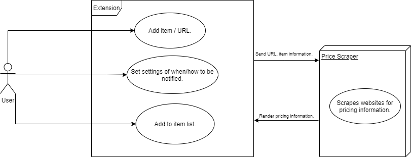

# Price Monitoring Scraper Extension

## Project Abstract
_The extension will provide a way for the user to record items and monitor their prices. This will allow the user to watch items on e-commerce websites like Amazon or eBay. The extension will have a list and the user can add items to it by providing a name and a URL that contains pricing information about the item. User can choose to be notified of the price change when the price falls under a certain percentage. Other additions could be automatically scraping a website for a specific item and then report back items that matched certain keywords and prices. The user can then add these items to the list to monitor. The advantages of this is that it will be performed in the background without the user having to spend effort in scrolling through a bunch of pages or rechecking multiple pages for possible sales._

## Project Relevance
_The project will practice Object-Oriented Programming using languages like Python or JavaScript to make the chrome extension and web scraper. UML diagrams will be used to plan the design of the extension. In terms of TDD, the test cases can be mockup web pages that can stimulate pricing changes or actual web pages to test scraping capabilities. The extension itself will provide a user interface. The project will also try to implement a database to store user information._

## Conceptual Design
_The languages involved with making a chrome extension will consist of JavaScript, HTML, and CSS. One option for the scraper is to use Python with the Selenium framework. Selenium will run underlying JavaScript on web pages to gain access to variables that cannot be obtained from simply scraping the HTML. Possible use of something like Django as the server and use of SQL as the database._
### Personal Contribution:
_I would work on the backend part of the extension, using a language like Python to perform the web scraping to obtain the prices of items._

## Background
_A URL reference to the project. Add text on how to build and run succesfully._ 

## Required Resources

- JavaScript, HTML, CSS
- Database languages like SQL
- Python
